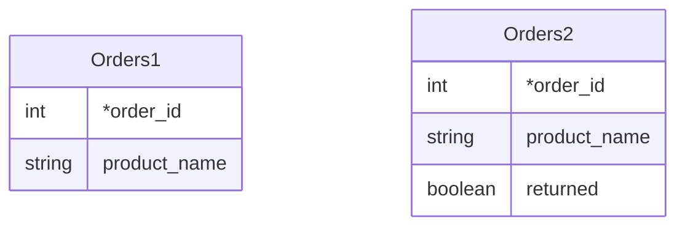
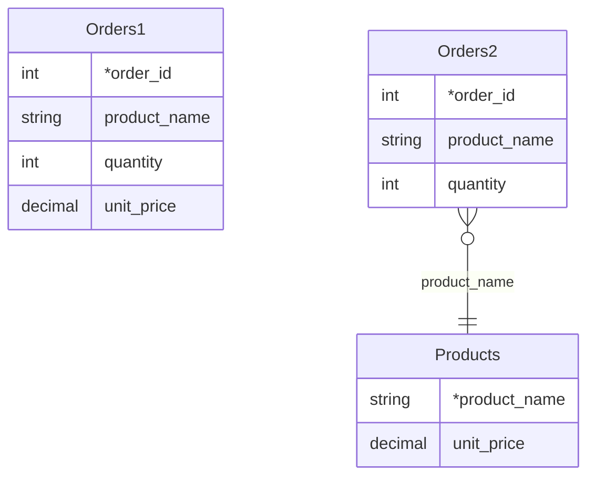

# Steps

### Definitions

A *step* is a small change to a database schema. For example, adding a
column to a table, changing the columns that make up its primary key,
or splitting a table into two normalized tables.

When a step is applied, there is a *pre-* and *post-schema*.

A *logical schema* is a SQL API, typically consisting of database
views, that an application uses to store and retrieve its data. A
schema may also include constraints (for example that the value of a
column must be non-negative) and may prevent certain operations (for
example that a particular table is read-only).

A *physical schema* is a set of tables where an application stores its
data.

A step can be applied to logical and physical schemas, but the
mechanics are different. To apply a step to a physical schema, the
database must make changes to the data structures, for example adding
a column to all of the rows. To apply a step to a logical schema, we
must use a *migration* process so that applications can continue to
use the before and after schema without disruption.

An *evolution* is a set of one or more steps applied in sequence.

A *migration* is a process that attempts to perform an evolution. It
passes through several phases, from INITIAL to DONE, that correspond
to changes to the physical schema and also determine which logical
schemas are valid. During a migration, a user ask that is the current
phase, can pause, and can roll back to the INITIAL phase.

## Kinds of steps

The following is a list of possible steps.

Step names follows some conventions. We use 'add' or 'drop' (not 'create', 'introduce' or 'remove'), and also 'alter' and 'rename'.

The term 'key' includes both primary and unique key (also called secondary key). Some databases require that primary keys are over columns that are not null and/or not modifiable, and some databases automatically create an index on keys.

We use the term 'column constraint' rather than 'check'.

We call a step *lossy* if it loses information (e.g. removing trailing spaces from `product_name`), *gainy* if it gains information (e.g. creating a table), and *reversible* if it is neither of these.

### DropColumn

Not the inverse of `AddColumn` unless the column is constrained to be a single value.

### DropTable

Not the inverse of `CreateTable` unless the table is constrained to be empty.

### DropView

Inverse of `CreateView`.

### AddCalculatedColumn

Equivalent to `AddColumn` followed by `AddCheck`.

There are three kinds of calculated column:
 * column is calculated and stored;
 * column calculated and not stored;
 * regular column that is constrained so that only one value is possible.

### AddSurrogateKey

Equivalent to `AddGeneratedColumn` + `AddKey`, plus optional `AlterKey` if there is an existing primary key that should become secondary.

### AddGeneratedColumn

Adds a column whose values come from a generator.

Variants include a shared generator (what Oracle calls a sequence) and a column-specific generator (what MSS calls a generated columns), options for the initial value of the generator, and the value type (e.g. ascending integers, UUIDs).

### AddKey

Adds a primary or unique key to an existing table. The key consists of one or more existing columns.

### AlterKey

Changes a key from primary to unique, or vice versa.

### CreateTable

Creates a table, initially empty.

Example,
```sql
CREATE TABLE Products (
  product_id INTEGER NOT NULL PRIMARY KEY,
  product_name VARCHAR(30) NOT NULL);
```

PRE user cannot see the table.

POST user can see the table and insert, update, delete rows.

Migration is straightforward, provided that there is no table of the same name.

### AddColumnWithDefault

Adds a column with a default value. The default value may be NULL, or a literal, or a deterministic expression involving the existing columns.

For example
```sql
ALTER TABLE Orders ADD returned BOOLEAN NOT NULL DEFAULT FALSE;
```

PRE users do not see the column.

POST users see the column with the default value in existing
rows. When inserting rows they may provide a value. They may update
the column's value in existing rows.



### NormalizeTable

Vertically splits one table into two tables, so that one or more
columns become the primary key of the new table, and remain in the old
table as a foreign key. Zero or more columns that are functionally
dependent are moved to the new table.

For example, `Orders (order_id, product_name, quantity, unit_price)`
becomes `Orders (order_id, product_name, quantity)` and `Products
(product_name, unit_price)`.



PRE users must comply with the constraint that the value is
functionally dependent. (If there is one order where Budweiser has a unit price of $3,
then it must be $3 in all orders.)

POST users must adhere to the foreign key relationship. (Before placing an order for Budweiser, make sure that there is a row in the `Products`
table.)

### MergeColumns

TODO figure out what Ambler means by this

### MergeTable

TODO figure out what Curino means by this

### RenameColumn

Renames a column within a table.

## ReorderColumns

Changes the ordering of columns in a table.

### RenameTable

Not equivalent to `DropTable` + `CreateTable`.

### RenameView

Decomposes to `DropView` + `CreateView`.

### AlterColumn

Replaces a column with an expression in terms of the other columns.

For example, you have table `OrderItems (order_id, item_number, product_id, quantity)`
and wish to change `item_number` from 1-based to 0-based. The expression is `item_number - 1`.

Equivalent to `RenameColumn` (optional) + `AddColumnWithDefault` + `DropColumn`.

This step is usually lossy but may be reversible.

## Support

The following table lists the priority for supporting particular step
types.

| Type | Physical       | Logical
| ---- | -------------- | --------
| add-column-default | Native   | Priority 1. Easy and common. 
| normalize-table | Complex | Priority 3. Difficult but desirable.
