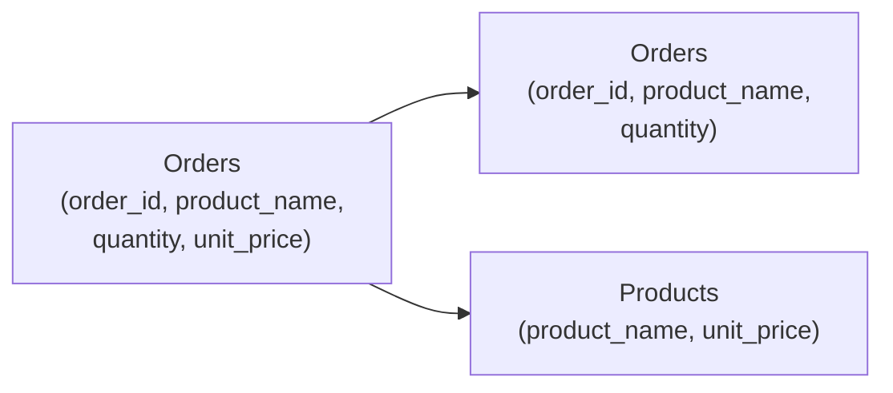

# Steps

### Definitions

A *step* is a small change to a database schema. For example, adding a
column to a table, changing the columns that make up its primary key,
or splitting a table into two normalized tables.

When a step is applied, there is a *pre-* and *post-schema*.

A *logical schema* is a SQL API, typically consisting of database
views, that an application uses to store and retrieve its data. A
schema may also include constraints (for example that the value of a
column must be non-negative) and may prevent certain operations (for
example that a particular table is read-only).

A *physical schema* is a set of tables where an application stores its
data.

A step can be applied to logical and physical schemas, but the
mechanics are different. To apply a step to a physical schema, the
database must make changes to the data structures, for example adding
a column to all of the rows. To apply a step to a logical schema, we
must use a *migration* process so that applications can continue to
use the before and after schema without disruption.

An *evolution* is a set of one or more steps applied in sequence.

A *migration* is a process that attempts to perform an evolution. It
passes through several phases, from INITIAL to DONE, that correspond
to changes to the physical schema and also determine which logical
schemas are valid. During a migration, a user ask that is the current
phase, can pause, and can roll back to the INITIAL phase.

## Kinds of steps

The following is a list of possible steps.

### add-column-default

Adds a column with a default value, for example
```sql
ALTER TABLE Orders ADD returned BOOLEAN NOT NULL DEFAULT FALSE;
```

PRE users do not see the column.

POST users see the column with the default value in existing
rows. When inserting rows they may provide a value. They may update
the column's value in existing rows.

### normalize-table

Vertically splits one table into two tables, so that one or more
columns become the primary key of the new table, and remain in the old
table as a foreign key. Zero or more columns that are functionally
dependent are moved to the new table.

For example, `Orders (order_id, product_name, quantity, unit_price)`
becomes `Orders (order_id, product_name, quantity)` and `Products
(product_name, unit_price)`.



## Support

The following table lists the priority for supporting particular step
types.

| Type | Physical       | Logical
| ---- | -------------- | --------
| add-column-default | Native   | Priority 1. Easy and common. 
| normalize-table | Complex | Priority 3. Difficult but desirable.
